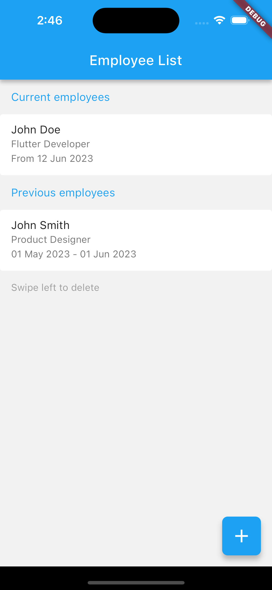
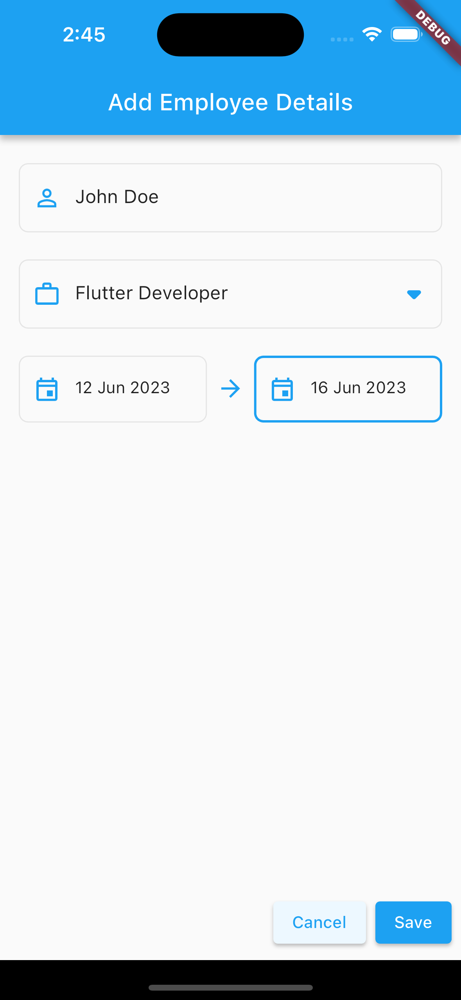
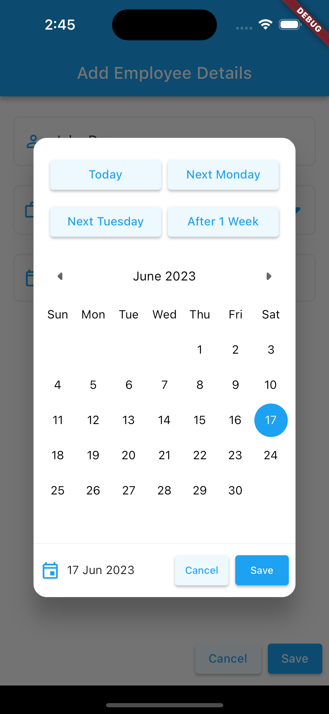

# Employee Tracker App


Employee Tracker app as part of an interview process, where I had the chance to showcase my mobile app development skills and design a user-friendly interface for managing employee data using Hive. Check it out!

## Screenshots

 Employee List | Add Employee | Custom Calender |
---------------|--------------|-----------------|
 |  |  |

## Technical Features

- Add/ Edit/ Delete employee data.
- Persistent data using local database (HIVE).
- BLoC state management.
- GoRouter.

## Clone the repository

   ```bash
   git clone https://github.com/your-username/employee-tracker-app.git
